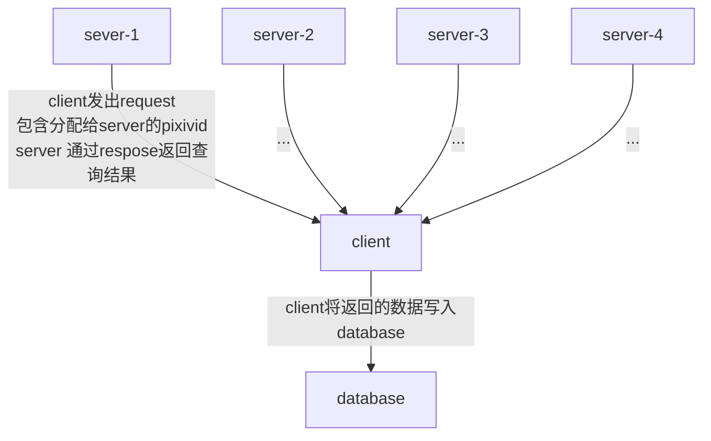

# PixivTJ
用来统计PIXIV的作品及TAG，用来做数据分析  
一个服务器太慢了 还是考虑多个服务器吧  

**服务器被撑爆了,现在考虑服务器做前端,用自己的电脑去分配任务写入数据**

## 结构

```mermaid
graph TB
    1[sever-1] --client发出request</br>包含分配给server的pixivid</br>server 通过respose返回查询结果--> 5[client]
    2[server-2] --"..."--> 5
    3[server-3] --"..."--> 5
    4[server-4] --"..."--> 5
    5[client] --client将返回的数据写入database-->6[database]
```
## server
server 做的事情基本可以用原来的代码不用修改,通信采用http协议
## client
cient要维护一个列表 包含访问、未访问列表,写入数据库。